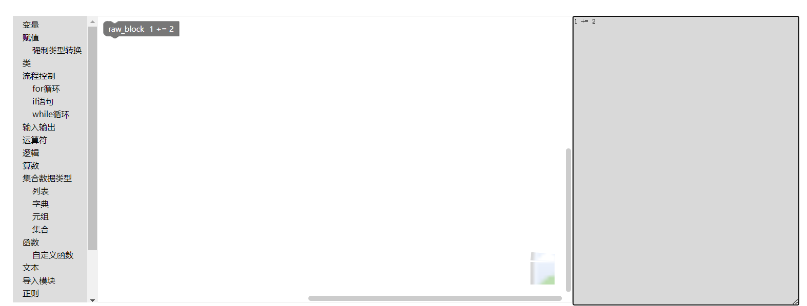

# Python on Drag and Drop

基于拖拽的 Python 语言及其应用是一个可以实现 python 语言与 Blockly 互相转换的库。所有的代码都是免费和开源的。

## Getting started

### 安装应用

以 npm 安装为例

```bash
npm install python-drag
```

## Usage

您可以在 Vue 文件中引用我们的包,然后使用我们事先准备的块或在工作区输入正确的 Python 代码

```Vue
<script>
import { init, PythonToBlocks } from 'python-drag'
import Blockly from 'blockly'
import 'blockly/python'
import * as Ch from 'blockly/msg/en'
init(Blockly)
Blockly.setlocale(Ch)
</script>
```

具体操作可以在[demo](https://se.jisuanke.com/project1/equation/pythondrag-demo)中进行实践

语法块的使用与 Blockly 的使用一致：

在 body 区域：

```xml
<xml id="toolbox">
  <category name="内置函数">
    <block type="abs"></block>
    <block type="aiter"></block>
  </category>
</xml>
```

在 script 区域：

```html
<script>
  const workspace = Blockly.inject('blocklyDiv', {
    toolbox: document.getElementById('toolbox')
  })

  function myUpdateFunction(event) {
    const code = Blockly.Python.workspaceToCode(workspace)
    document.getElementById('textarea').value = code
  }
</script>
```

输入正确的 python 代码后：


输入错误的 Python 代码后：



## functions

主要包括以下功能：
四大集合数据类型、正则、二进制、强制类型转换、内置函数等。

## test

测试主要为模块转代码部分的测试

### 模块转代码

```javascript
// 导入已经打包好的function
import functions from '../src/function'
// 工作区生成
const workspace = new functions.Workspace()
const generator = functions.Python
generator.init(workspace)
// 生成目标块
const assignBlock = workspace.newBlock('assign_operator') // 测试的主要连接块
const inputBlock = workspace.newBlock('input')
const textBlock = workspace.newBlock('variables_get_dynamic')
// 用于测试
assignBlock.disabled = false
// 连接块，注意块之间的输入输出类型要匹配
assignBlock.getInput('variable').connection.connect(textBlock.outputConnection)
assignBlock.getInput('value').connection.connect(inputBlock.outputConnection)
// 进行测试
test('assign_operator and input', () => {
  // 'assign_operator and input'是测试名
  expect(generator.blockToCode(assignBlock)).toEqual([
    '_25_7BBKY_VARIABLES_DEFAULT_NAME_7D = (input(null))',
    99
  ])
})
```

### 代码转模块

## Support

- 在 gitlab 上[提出Issue](https://se.jisuanke.com/project1/equation/python-language-based-on-drag-and-drop/-/issues) 或提交合并请求(https://se.jisuanke.com/project1/equation/python-language-based-on-drag-and-drop/-/merge_requests)

## Roadmap

进一步完善 Blockly 和 Python 相互转换的功能，提供不同 python 版本的包

## Contributing

想让 Python on Drag and Drop 变得更好吗？我们欢迎以拉取请求，错误报告，文档，论坛上的答案等形式为 Python on Drag and Drop 做出贡献！

# Document

[技术文档](https://se.jisuanke.com/project1/equation/python-language-based-on-drag-and-drop/-/blob/main/technical%20documentation.md)
[使用说明书](https://se.jisuanke.com/project1/equation/python-language-based-on-drag-and-drop/-/blob/main/instructionManual.md)
[测试文档](https://se.jisuanke.com/project1/equation/python-language-based-on-drag-and-drop/-/blob/main/FunctionTest.md)


## Authors and acknowledgment

## License

[MIT](https://choosealicense.com/licenses/mit/)
